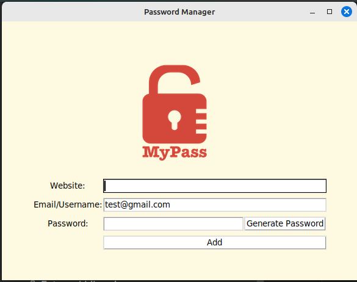

# 🔐 Password Manager (Tkinter)

A simple graphical password manager built with Python's `tkinter` library. 
It allows you to generate secure passwords, copy them to your clipboard, 
and save your login credentials locally.

## Interface

## 🚀 Features

- 🔒 Generate strong random passwords with letters, numbers, and symbols
- 📋 Automatically copy the password to clipboard
- 💾 Save website, email, and password to a local file (`data.txt`)
- ⚠️ Field validation – prompts if any input is missing
- ✅ Confirmation dialog before saving credentials
- 🎨 Clean and intuitive GUI with custom logo support

👩‍💻 Author  
Created with ❤️ using Python.
